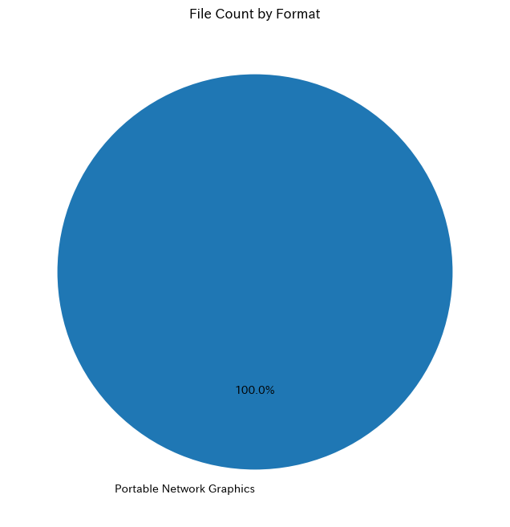
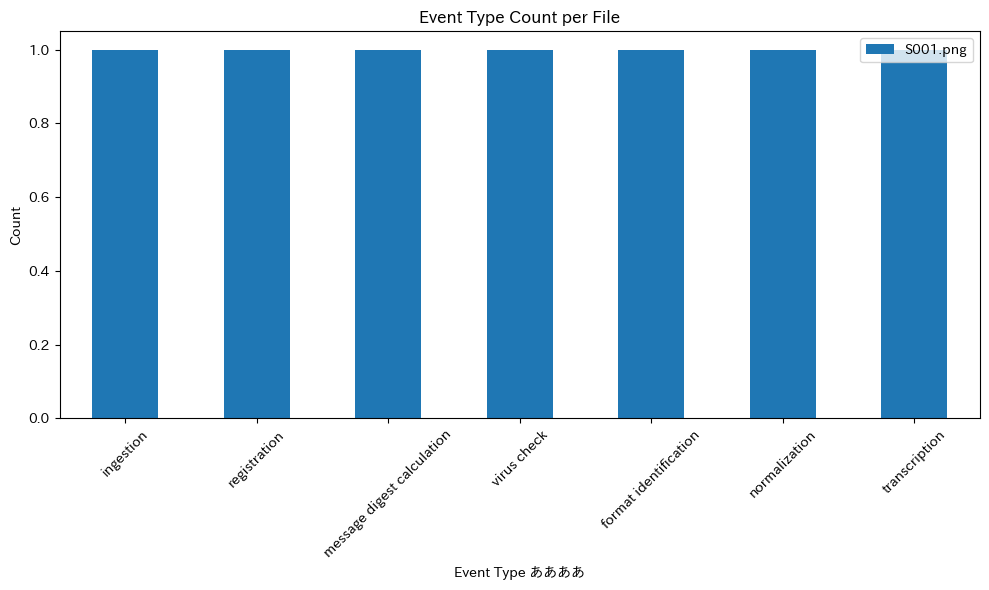

# mets_tools


<!-- WARNING: THIS FILE WAS AUTOGENERATED! DO NOT EDIT! -->

Human-Friendly Exploration Tool for Archivematica METS Files

This tool is based on [METSFlask by Tim
Walsh](https://github.com/tw4l/METSFlask).

METSFlask provides a foundation for interacting with and visualizing
METS (Metadata Encoding and Transmission Standard) files. Building on
this work, this tool offers additional features designed specifically
for exploring and understanding Archivematica METS files, with a focus
on accessibility and user-friendly navigation.

## Usage

### Installation

Install latest from the GitHub
[repository](https://github.com/nakamura196/mets_tools):

``` sh
$ pip install git+https://github.com/nakamura196/mets_tools.git
```

### Documentation

Documentation can be found hosted on this GitHub
[repository](https://github.com/nakamura196/mets_tools)’s
[pages](https://nakamura196.github.io/mets_tools/).

## How to use

``` python
from mets_tools.core import METSFile

local_file = "./test.xml"
ins = METSFile(local_file)
ins.parse_mets()
```

### Original Files

``` python
original_files = ins.get_original_files()
original_files
```

<div>
<style scoped>
    .dataframe tbody tr th:only-of-type {
        vertical-align: middle;
    }
&#10;    .dataframe tbody tr th {
        vertical-align: top;
    }
&#10;    .dataframe thead th {
        text-align: right;
    }
</style>

<table class="dataframe" data-quarto-postprocess="true" data-border="1">
<thead>
<tr class="header" style="text-align: right;">
<th data-quarto-table-cell-role="th"></th>
<th data-quarto-table-cell-role="th">amdsec_id</th>
<th data-quarto-table-cell-role="th">filepath</th>
<th data-quarto-table-cell-role="th">uuid</th>
<th data-quarto-table-cell-role="th">hashtype</th>
<th data-quarto-table-cell-role="th">hashvalue</th>
<th data-quarto-table-cell-role="th">bytes</th>
<th data-quarto-table-cell-role="th">format</th>
<th data-quarto-table-cell-role="th">version</th>
<th data-quarto-table-cell-role="th">puid</th>
<th data-quarto-table-cell-role="th">modified_date</th>
<th data-quarto-table-cell-role="th">fits_modified_unixtime</th>
<th data-quarto-table-cell-role="th">filename</th>
<th data-quarto-table-cell-role="th">size</th>
</tr>
</thead>
<tbody>
<tr class="odd">
<td data-quarto-table-cell-role="th">0</td>
<td>amdSec_2</td>
<td>S001.png</td>
<td>386c4295-64fb-45b9-b5c6-3adfcd7f2bcf</td>
<td>sha256</td>
<td>5288586020b7ff120ad53f94432f719aa0ca1c5e094dc9...</td>
<td>9097282</td>
<td>Portable Network Graphics</td>
<td>1.2</td>
<td>&lt;a href="http://nationalarchives.gov.uk/PRONOM...</td>
<td>2024-10-25T03:00:20Z</td>
<td></td>
<td>S001.png</td>
<td>9 MB</td>
</tr>
</tbody>
</table>

</div>

### File Format Counts

``` python
ins.visualize_file_format_counts()
```



### File Events Count

``` python
ins.visualize_file_events_count()
```



### File Section

``` python
df = ins.parse_file_sec()
df
```

<div>
<style scoped>
    .dataframe tbody tr th:only-of-type {
        vertical-align: middle;
    }
&#10;    .dataframe tbody tr th {
        vertical-align: top;
    }
&#10;    .dataframe thead th {
        text-align: right;
    }
</style>

<table class="dataframe" data-quarto-postprocess="true" data-border="1">
<thead>
<tr class="header" style="text-align: right;">
<th data-quarto-table-cell-role="th"></th>
<th data-quarto-table-cell-role="th">USE</th>
<th data-quarto-table-cell-role="th">File ID</th>
<th data-quarto-table-cell-role="th">Group ID</th>
<th data-quarto-table-cell-role="th">ADMID</th>
<th data-quarto-table-cell-role="th">File Location</th>
<th data-quarto-table-cell-role="th">LOCTYPE</th>
<th data-quarto-table-cell-role="th">OTHERLOCTYPE</th>
</tr>
</thead>
<tbody>
<tr class="odd">
<td data-quarto-table-cell-role="th">0</td>
<td>original</td>
<td>file-386c4295-64fb-45b9-b5c6-3adfcd7f2bcf</td>
<td>Group-386c4295-64fb-45b9-b5c6-3adfcd7f2bcf</td>
<td>amdSec_2</td>
<td>objects/S001.png</td>
<td>OTHER</td>
<td>SYSTEM</td>
</tr>
<tr class="even">
<td data-quarto-table-cell-role="th">1</td>
<td>submissionDocumentation</td>
<td>file-f6acdbb3-095f-4771-8fd9-8c5b74e296ec</td>
<td>Group-f6acdbb3-095f-4771-8fd9-8c5b74e296ec</td>
<td>amdSec_5</td>
<td>objects/submissionDocumentation/transfer-png-c...</td>
<td>OTHER</td>
<td>SYSTEM</td>
</tr>
<tr class="odd">
<td data-quarto-table-cell-role="th">2</td>
<td>preservation</td>
<td>file-6f93b80d-fb6d-41b6-819e-b9bc3ad085e6</td>
<td>Group-386c4295-64fb-45b9-b5c6-3adfcd7f2bcf</td>
<td>amdSec_1</td>
<td>objects/S001-6f93b80d-fb6d-41b6-819e-b9bc3ad08...</td>
<td>OTHER</td>
<td>SYSTEM</td>
</tr>
<tr class="even">
<td data-quarto-table-cell-role="th">3</td>
<td>text/ocr</td>
<td>file-bd353cfc-64aa-4f48-af61-4a4d8ee3a55b</td>
<td>Group-386c4295-64fb-45b9-b5c6-3adfcd7f2bcf</td>
<td>amdSec_3</td>
<td>objects/metadata/OCRfiles/S001-386c4295-64fb-4...</td>
<td>OTHER</td>
<td>SYSTEM</td>
</tr>
<tr class="odd">
<td data-quarto-table-cell-role="th">4</td>
<td>metadata</td>
<td>file-d8aa2e08-71bd-4852-9d87-e6eba354affb</td>
<td>Group-d8aa2e08-71bd-4852-9d87-e6eba354affb</td>
<td>amdSec_4</td>
<td>objects/metadata/transfers/png-c4688ddd-8bb7-4...</td>
<td>OTHER</td>
<td>SYSTEM</td>
</tr>
</tbody>
</table>

</div>

### Structure Map

``` python
ins.visualize_structMap()
```

    StructMap (TYPE: physical, LABEL: Archivematica default)
    └── Directory: png-e5e48d8a-421a-461d-8e55-468bf37253a8
        └── Directory: objects
            ├── Item: S001.png
            ├── Item: S001-6f93b80d-fb6d-41b6-819e-b9bc3ad085e6.tif
            ├── Directory: submissionDocumentation
            │   └── Directory: transfer-png-c4688ddd-8bb7-4593-b4bf-f4302ea6882c
            │       └── Item: METS.xml
            └── Directory: metadata
                ├── Directory: OCRfiles
                │   └── Item: S001-386c4295-64fb-45b9-b5c6-3adfcd7f2bcf.txt
                └── Directory: transfers
                    └── Directory: png-c4688ddd-8bb7-4593-b4bf-f4302ea6882c
                        └── Item: directory_tree.txt
    StructMap (TYPE: logical, LABEL: Normative Directory Structure)
    └── Directory: png-e5e48d8a-421a-461d-8e55-468bf37253a8
        └── Directory: objects
            ├── Item: S001.png
            ├── Item: S001-6f93b80d-fb6d-41b6-819e-b9bc3ad085e6.tif
            ├── Directory: submissionDocumentation
            │   └── Directory: transfer-png-c4688ddd-8bb7-4593-b4bf-f4302ea6882c
            │       └── Item: METS.xml
            └── Directory: metadata
                ├── Directory: OCRfiles
                │   └── Item: S001-386c4295-64fb-45b9-b5c6-3adfcd7f2bcf.txt
                └── Directory: transfers
                    └── Directory: png-c4688ddd-8bb7-4593-b4bf-f4302ea6882c
                        └── Item: directory_tree.txt

### File Changes

``` python
ins.show_file_changes()
```

    ファイル名の変更は見つかりませんでした。
